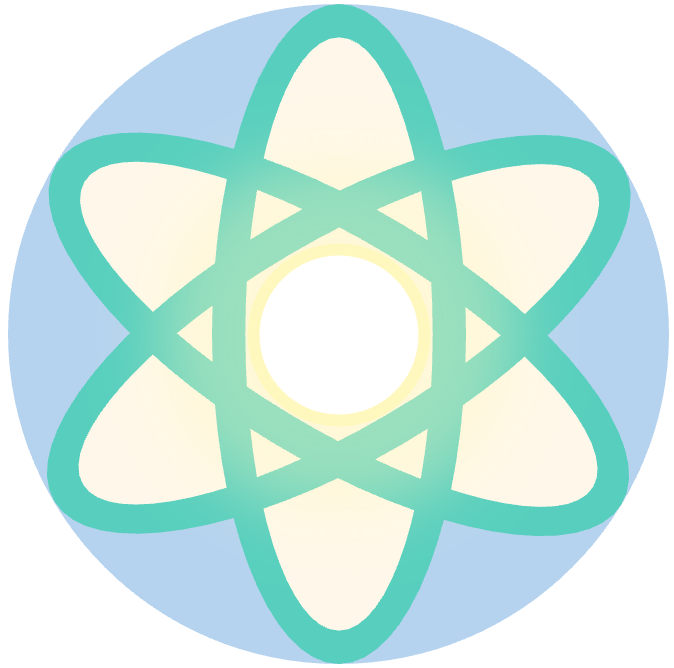

<p align="center">
  
</p>

<p align="center">
  <a href="https://taoeli.github.io/MaxwellLink/">
    
  </a>
  <a href="LICENSE">
    
  </a>
  
</p>

**MaxwellLink** is a free and open-source framework for self-consistent light–matter simulations. It bridges electromagnetic solvers, such as [Meep](https://meep.readthedocs.io/en/latest/) or the built-in single-mode cavity, with heterogeneous molecular drivers spanning [QuTiP](https://qutip.org/), [Psi4](https://psicode.org/), [ASE](https://wiki.fysik.dtu.dk/ase/), and [LAMMPS](https://www.lammps.org/). This code can be used for both demonstration and production calculation purposes. Particularly, with a socket-based architecture, large-scale self-consistent light-matter simulations can be performed efficiently accross multiple HPC nodes.

## Key Features

- **Embracing state-of-the-art ecosystems** in both computational electrodynamics and quantum chemistry, extending the boundary of light-matter simulations.
- **Unified Python interfaces** for socket-connected and embedded molecular drivers in light-matter simulations.
- **Heterogeneous molecular theories** including TLS, QuTiP model Hamiltonians, Psi4 RT-TDDFT/Ehrenfest, ASE classical dynamics, and LAMMPS via `fix mxl`, all in one EM simulation.
- **Extensible code structure** to add custom EM solvers or molecular drivers with minimal efforts.

## Quick Start

Create a fresh conda environment and install from source:

```bash
CONDA_ENV="mxl"
conda create -n "$CONDA_ENV" python=3.13
conda activate "$CONDA_ENV"

git clone https://github.com/TaoELi/MaxwellLink.git
cd MaxwellLink
pip install .
```

Optional drivers (Meep, QuTiP, Psi4, ASE, LAMMPS) can be added by following the instructions in the documentation.

## Documentation

Visit the [documentation](https://taoeli.github.io/MaxwellLink/) for installation details, tutorials, API reference, and guidelines on extending **MaxwellLink**.

## Citation

If **MaxwellLink** helps your research, please cite this project together with the coupled solvers you employ (e.g., Meep, Psi4, QuTiP, ASE, LAMMPS).

- X. Ji, A. F. Bocanegra Vargas, G. Meng, and T. E. Li. MaxwellLink: A Unified Framework for Self-Consistent Light-Matter Simulations. *Submitted* 2025.

