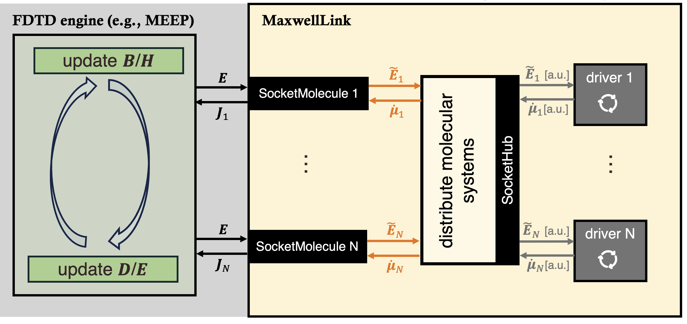

MaxwellLink Documentation
======================================

MaxwellLink couples various electromagnetics (EM) solvers, such as finite-difference time-domain (FDTD) approach, with
quantum and molecular dynamics packages through a lightweight socket interface, enabling the simulation of self-consistent
light-matter interactions across multiple scales.

Use this documentation to install the toolkit, build your first coupled light-matter simulation, and
explore the available EM solvers and molecular drivers.

.. toctree::
   :maxdepth: 1
   :caption: Get Started

   introduction
   installation
   usage
   theory

.. toctree::
   :maxdepth: 1
   :caption: Tutorials

   tutorials/index

.. toctree::
   :maxdepth: 1
   :caption: Learn More

   architecture
   em_solvers/index
   drivers/index

.. toctree::
   :maxdepth: 1
   :caption: Reference

   api/maxwelllink
